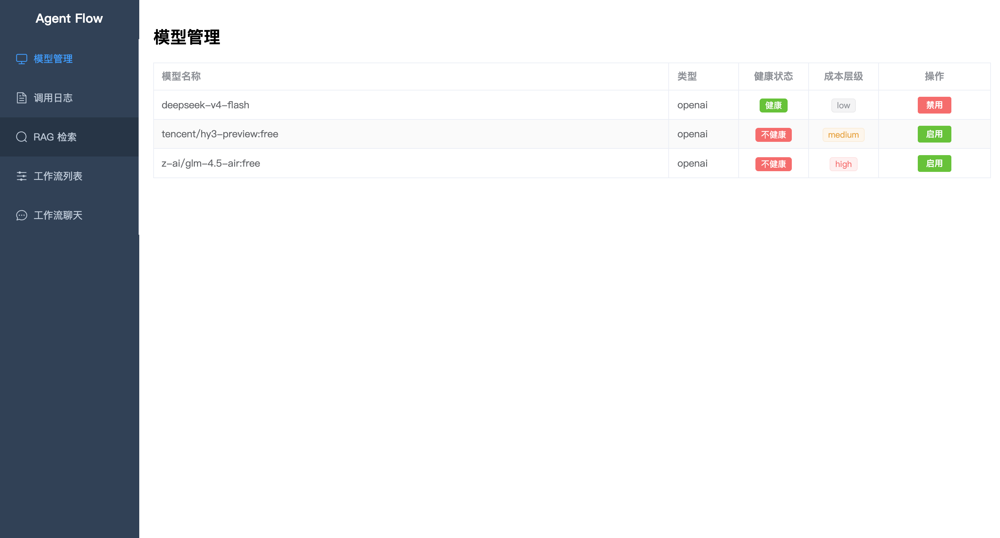
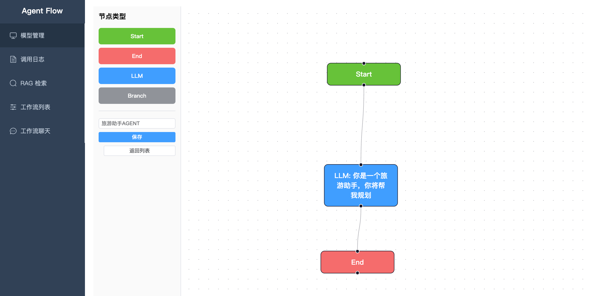
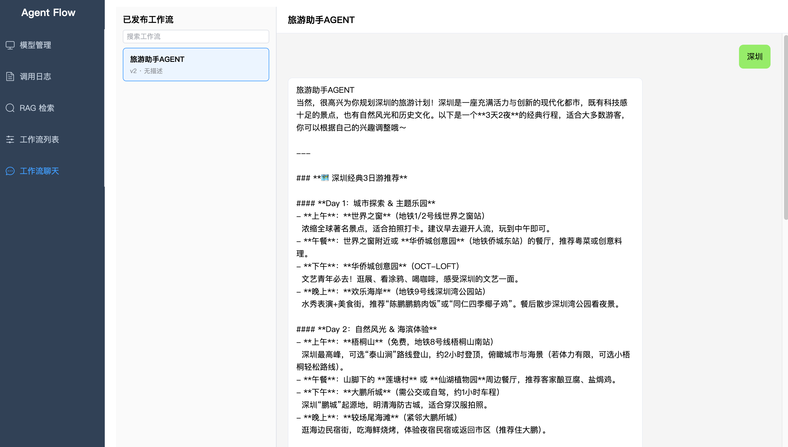

# Agent Flow

> 本项目的 AI 开发工具为 [opencode](https://opencode.ai)，默认使用模型 `deepseek/deepseek-v4-pro`。

AI Agent 工作流编排平台，支持多模型路由、RAG 知识库检索与可视化 DAG 工作流设计。

## 展示




## 使用引导

| 你想做什么 | 看这里 |
|-----------|--------|
| 了解项目整体架构与技术栈 | `docs/architecture.md` |
| 查看 API 端点清单 | `docs/schema/api-endpoints.md` |
| 了解数据库表结构 | `docs/schema/schema.md` |
| 查看编码规范 | `docs/conventions.md` |
| 开始新需求开发 | `AGENTS.md` → `docs/roadmap/current.md` |
| AI 智能体入口 | `AGENTS.md` |

### 快速启动

```bash
# 1. 环境变量
cp .env.example .env
# 编辑 .env，填入各 LLM 服务的 API Key

# 2. 本地配置覆盖
cp agent-flow-app/src/main/resources/application-local.yml.example \
   agent-flow-app/src/main/resources/application-local.yml
# 编辑 application-local.yml，填入模型 API Key（本地开发时优先级高于 .env）

# 3. 中间件
docker compose up -d postgres redis

# 4. 数据库迁移（首次启动或 schema 变更后执行）
docker exec ai-agent-db psql -U ai_user -d ai_customer_service \
  -f /docker-entrypoint-initdb.d/01-schema.sql

# 5. 启动
./mvnw spring-boot:run           # 后端 http://localhost:8080
cd frontend && npm install && npm run dev   # 前端 http://localhost:3000
```

### 所需 API Key

| 用途 | 环境变量 | 获取地址 |
|------|----------|----------|
| LLM 对话（主要） | `DEEPSEEK_API_KEY` | [platform.deepseek.com](https://platform.deepseek.com) |
| LLM 对话（备选） | `OPENROUTER_API_KEY` | [openrouter.ai](https://openrouter.ai) |
| Azure OpenAI | `AZURE_OPENAI_API_KEY` | [portal.azure.com](https://portal.azure.com) |
| RAG 向量嵌入 | `SILICONFLOW_API_KEY` | [siliconflow.cn](https://siliconflow.cn) |

> 至少需要配置一个 LLM API Key（推荐 DeepSeek），RAG 功能还需配置嵌入模型 Key（推荐 SiliconFlow）。

### 配置文件说明

```
agent-flow-app/src/main/resources/
├── application.yml                   # 主配置（模型定义、数据库、Redis 等）
├── application-local.yml             # 本地覆盖（profile: local 时生效，已在 .gitignore 中）
└── db/schema.sql                     # 数据库初始化脚本
```

- **`.env`** — 存放敏感信息（API Key、数据库密码），不进入版本控制
- **`application.yml`** — 通用配置，通过 `${ENV_VAR:default}` 引用 .env 中的值
- **`application-local.yml`** — 本地开发时覆盖 `application.yml` 中的模型列表（直接填写 Key），优先级高于 .env

## 技术栈

Java 21 · Spring Boot 3.5 · MyBatis-Plus 3.5 · LangChain4j 1.13 · Resilience4j · PostgreSQL (pgvector) · Redis · Vue 3 + Element Plus

## License

MIT
